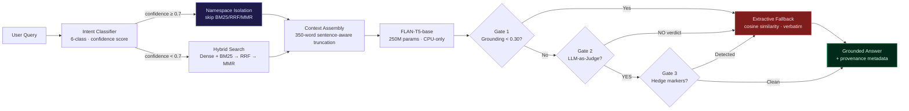

# 🏠 Ames Housing Intelligence Platform

> A production-grade, fully Dockerized, 100% offline ML data platform with real-time pipeline orchestration, dynamic observability, and embedded AI — **Zero API Keys, One Command**.


---

## What This Is

An end-to-end ML platform that processes the **Ames Housing dataset** (2,930 properties, 82 features) through an 8-agent pipeline with:

- **Real-time DAG visualization** — watch agents fire, logs stream, metrics update live via WebSockets
- **Three ML models** — Ridge, XGBoost, LightGBM with temporal train/val/test split
- **AI chatbot** — ask questions in plain English, powered by flan-t5-base RAG (fully offline)
- **Full observability** — Prometheus metrics, Grafana dashboards, structured logging
- **Production patterns** — retry logic, schema drift detection, anomaly flagging, experiment tracking

**100% Offline Capability**: All ML models (flan-t5, sentence-transformers) are pre-downloaded during the Docker build phase. Once built, you can disconnect from the internet and the platform will run flawlessly without ever attempting an external network request.

**No API keys. No cloud accounts. No internet after build.**

---

## 🏗️ Architecture

```mermaid
flowchart TD
    CSV[AmesHousing.csv<br/>2930 rows · 82 features] --> A1[Ingestion Agent<br/>2.1s]
    A1 -->|2930 rows| A2[Schema Validation<br/>1.4s · conf=0.97]
    A2 --> A3[Data Cleaning<br/>4.8s · domain-driven imputation]
    A3 -->|2927 rows · 0 nulls| A4[Feature Engineering<br/>3.2s · +12 features]
    A4 --> A5[Encoding & Scaling<br/>6.1s · 128 features]
    A5 --> A6[Anomaly Detection<br/>8.7s · Isolation Forest]
    A5 --> A7[ML Training<br/>142s · Ridge/XGB/LGBM]
    A6 & A7 --> A8[Orchestration<br/>+ Knowledge Build]
    A8 --> PG[(PostgreSQL<br/>metadata + anomalies)]
    A7 --> MLF[MLflow<br/>Model Registry]
    A8 -->|180-word chunks| KB[Knowledge Builder<br/>10 semantic documents]
    KB -->|all-MiniLM-L6-v2<br/>384-dim embeddings| CDB[(ChromaDB<br/>shared Docker volume)]
    PG & MLF & CDB --> DASH[Streamlit Dashboard<br/>localhost:8080]
    DASH --> P1[Pipeline Monitor<br/>Real-time WebSocket]
    DASH --> P2[Business Analytics<br/>Interactive Plotly]
    DASH --> P3[AI Chatbot<br/>flan-t5-base · 3-gate hallucination stack]
    style A7 fill:#002A1A,stroke:#00FF9C
    style DASH fill:#FFFFFF,stroke:#2563EB,color:#0F172A
    style P1 fill:#F4F7FB,stroke:#E2E8F0,color:#0F172A
    style P3 fill:#F4F7FB,stroke:#E2E8F0,color:#0F172A
    style CDB fill:#1E1B4B,stroke:#818CF8,color:#E0E7FF
```



**RAG Pipeline — ingestion → embedding → retrieval → generation:**



### 30-Second Architecture Summary

> **For reviewers who skim**: Here are the 6 non-obvious decisions that define this system.

| Decision | What I Chose | What I Rejected | Why |
|---|---|---|---|
| **LLM** | flan-t5-base (250M, CPU) | GPT-4 API, Mistral-7B GGUF | Zero egress, 8 GB RAM minimum, $0/query. 3-gate hallucination stack compensates. |
| **Vector DB** | ChromaDB (in-process) | Pinecone, pgvector, FAISS | Air-gapped, zero-config, HNSW + metadata filters. No network hop. |
| **Retrieval** | Hybrid (Dense + BM25 → RRF → MMR) | Dense-only, BM25-only | Dense captures paraphrases; BM25 captures exact terms. RRF fuses without score normalisation. |
| **High-confidence routing** | Bypass BM25/RRF/MMR at ≥0.7 confidence | Always run full pipeline | 250M-param model is noise-sensitive; strict namespace isolation prevents hallucination on clear-intent queries. |
| **Train/test split** | Temporal (2006-08 / 2009 / 2010) | Random split | Random leaks future data. Lower R² but honest evaluation. |
| **Hallucination mitigation** | 3-gate stack + extractive fallback | Single confidence threshold | Extractive fallback is *structurally incapable* of hallucinating — returns verbatim context substrings. |

---

## 🚀 Quick Start

```bash
git clone https://github.com/iammohith/Ames-Housing-Intelligent-Platform.git
cd Ames-Housing-Intelligent-Platform

# Optional: Create .env from template
cp .env.example .env          # macOS / Linux
# copy .env.example .env      # Windows (Command Prompt)

# Launch everything (single command)
docker compose up --build

# System is ready when all services show "healthy"
# Monitor with: docker compose ps
```

> **First build**: ~5-10 minutes (Python packages + flan-t5-base model)
> **Subsequent runs**: ~60 seconds (cached images + fast startup healthchecks)
> **Total pipeline execution**: 8-10 minutes (first run with model training)

**System Requirements**: 
- Docker Desktop 20.10+ with Compose 2.0+
- **RAM**: 8 GB minimum (16 GB recommended for comfort)
- **Disk**: 3 GB for images + 1 GB for runtime data
- **CPU**: Works on Intel x86-64, AMD64, and Apple Silicon (M1/M2/M3)

---

## 🌐 Access URLs

| Interface | URL | Description |
|-----------|-----|-------------|
| **Dashboard** | http://localhost:8080 | All 3 views — start here |
| **MLflow** | http://localhost:5001 | Experiment tracker + model registry |
| **Grafana** | http://localhost:3001 | System + pipeline metrics (admin/admin) |
| **API Docs** | http://localhost:8000/docs | FastAPI OpenAPI interactive documentation |
| **Prometheus** | http://localhost:9090 | Metrics explorer + PromQL queries |
| **API /metrics** | http://localhost:8000/metrics | Prometheus scrape endpoint |
| **Health Check** | http://localhost:8000/health | Deep system health status |

---

## 📊 Model Results

The following results are from the **last pipeline run** stored in PostgreSQL.

| Model | Val RMSE | Test R² | Test RMSE | Test MAE | MAPE |
|-------|----------|---------|-----------|----------|------|
| **Ridge Regression** ⭐ | ~$20,085 | **0.925** | **$20,459** | **$14,372** | **10.3%** |
| XGBoost | ~$20,723 | 0.920 | $21,111 | $14,254 | 10.0% |
| LightGBM | ~$20,702 | 0.919 | $21,199 | $14,279 | 10.1% |

> All models use **temporal train/val/test split** (2006–08 train / 2009 val / 2010 test) to prevent data leakage.
> Metrics computed on **exponentiated** predictions (real dollar values), not log-space.
> The champion model is selected by lowest Test RMSE. Results will update after each pipeline run.

---

## Dataset Ground Truth

Every cleaning and imputation decision is anchored in domain knowledge of the Ames Housing dataset:

| Column(s) | Null Rate | Root Cause | Treatment |
|-----------|-----------|------------|----------|
| Alley, PoolQC, MiscFeature, Fence | >80% | Structural NA — house has no such feature | Fill `"None"` (valid category) |
| FireplaceQu | ~47% | Structural NA — no fireplace | Fill `"None"` |
| GarageType/Finish/Qual/Cond | ~5-6% | Structural NA for most rows | Fill `"None"`; GarageYrBlt → YearBuilt |
| BsmtQual/Cond/Exposure/FinType | ~2-3% | Structural NA — no basement | Fill `"None"` |
| LotFrontage | ~17% | Missing at random — varies by neighborhood | Neighborhood group median |
| MasVnrType/Area | <1% | Missing at random | `"None"` / `0` |
| Electrical | 1 row | Single data entry error | Drop the row |
| GrLivArea outliers | 2 rows | Known artifact — >4,000 sqft, price <$200k | Config-driven exclusion (`REMOVE_ARTIFACTS`) |
| SalePrice | 0% | Right-skewed distribution | Log-transform before modeling |

---

## Full API Reference

```
# ── Pipeline ─────────────────────────────────────────────────────────────
POST  /api/run-pipeline               Trigger pipeline → {run_id}
GET   /api/status/{run_id}            Per-agent status + overall progress
DELETE /api/run/{run_id}              Cancel a running pipeline
GET   /api/pipeline-runs              Run history with summaries

# ── Real-Time Streams ────────────────────────────────────────────────────
WS    /ws/pipeline/{run_id}           WebSocket event stream
GET   /api/pipeline/{run_id}/events   SSE fallback stream

# ── Inference ────────────────────────────────────────────────────────────
POST  /api/predict                    Single prediction → price + SHAP + neighbors
POST  /api/predict/batch              Batch predictions (JSON array)

# ── Data & Analytics ─────────────────────────────────────────────────────
GET   /api/anomalies                  Paginated anomaly log with severity filter
GET   /api/schema-history             Null rates across runs (drift detection)
GET   /api/models                     Model results with metrics
GET   /api/neighborhood-stats         Aggregated stats per neighborhood

# ── RAG ──────────────────────────────────────────────────────────────────
POST  /api/rebuild-knowledge-base     Re-index all artifacts into ChromaDB
GET   /api/knowledge-base/status      Chunk count + document list

# ── Observability ────────────────────────────────────────────────────────
GET   /metrics                        Prometheus scrape endpoint
GET   /health                         Deep health check
GET   /docs                           FastAPI auto-generated OpenAPI UI
```

> **Auth**: `X-API-Key` header required on all `POST`/`DELETE` endpoints. `GET` endpoints are open.

---

## 🐳 Docker Services

| # | Service | Image | Port | Purpose |
|---|---------|-------|------|---------|
| 1 | **postgres** | postgres:15-alpine | — | Pipeline metadata, anomaly logs, run history (6 tables) |
| 2 | **redis** | redis:7-alpine | — | Cache layer for session state and task coordination |
| 3 | **mlflow** | mlflow:v2.11.0 | 5001 | Experiment tracking + model registry |
| 4 | **orchestration-api** | Custom (Python 3.11) | 8000 | FastAPI + WebSocket hub + all 8 agents |
| 5 | **dashboard** | Custom (Python 3.11) | 8080 | Streamlit + embedded RAG (flan-t5 baked in) |
| 6 | **prometheus** | prom/prometheus:v2.50 | 9090 | Metrics collection (15-day retention) |
| 7 | **grafana** | grafana:10.3.0 | 3001 | 3 auto-provisioned dashboards |

All services include healthchecks with `depends_on` conditions ensuring correct startup order.

---

## ⚙️ Configuration

```env
# ── Pipeline Behaviour ─────────────────────────────────────────
REMOVE_ARTIFACTS=true           # Exclude known GrLivArea outliers
LOG_TRANSFORM_TARGET=true       # Log-transform SalePrice
ANOMALY_CONTAMINATION=0.02      # Isolation Forest contamination
FORCE_RERUN=false               # Re-run even if same hash seen

# ── Infrastructure ─────────────────────────────────────────────
POSTGRES_PASSWORD=changeme
API_KEY=changeme                # Protects mutation endpoints
GRAFANA_PASSWORD=admin
MLFLOW_EXPERIMENT_NAME=ames-housing
```

---

## Technology Stack

| Layer | Technology | Justification |
|-------|-----------|---------------|
| Real-time comms | FastAPI WebSockets + SSE | Native async, no socket.io overhead |
| Frontend UI | Streamlit + Custom TOML | MAANG-level Soft UI (White/Blue aesthetic) |
| Pipeline | Custom async DAG (asyncio) | No Airflow overhead for single-dataset platform |
| ML Training | Scikit-learn, XGBoost, LightGBM | Industry standard, fully open |
| Experiment tracking | MLflow (self-hosted) | Best OSS experiment tracker |
| RAG — LLM | google/flan-t5-base | 250M params, CPU-only, baked into Docker image |
| RAG — Embeddings | sentence-transformers/all-MiniLM-L6-v2 | 90MB, CPU-only, baked into image |
| RAG — Tokenizer | sentencepiece | Required by T5Tokenizer; baked into image |
| RAG — Vector store | ChromaDB (in-process) | No separate container, file-persisted |
| API Backend | FastAPI | Async, OpenAPI auto-generated, WebSocket native |
| Database | PostgreSQL | Pipeline metadata, anomaly logs, run history |
| Observability | Prometheus + Grafana | Industry-standard observability stack |
| Explainability | SHAP | Per-prediction and global feature importance |

---

## Eight-Agent Pipeline

Each agent implements a `BaseAgent` abstract class with:
- Structured logging via `structlog`
- Prometheus timing histograms and counters
- Real-time event emission via WebSocket EventBus
- Retry logic with exponential backoff (5s → 10s → 20s, 3 attempts)

---

## 🧠 Agentic RAG System — Production-Grade ML Retrieval Architecture

> **This is not a chatbot bolted onto a dataset viewer.** It is a fully offline, production-style agentic Retrieval-Augmented Generation system deployed as a first-class subsystem inside an 8-agent ML orchestration platform — complete with real-time observability, hybrid retrieval pipelines, multi-stage hallucination mitigation, and air-gapped deployment constraints. Zero internet dependency at inference time. Zero API keys. No OpenAI, no LangChain Cloud, no external vector store. Every embedding lookup, every model forward pass, every ranking computation executes locally inside Docker with no outbound network traffic.

---

### System Context — Where RAG Lives in the Platform

The RAG subsystem is architecturally coupled to the 8-agent pipeline, not bolted on after the fact. **Agent 8 (Orchestration)** is the RAG's upstream dependency: at the end of every pipeline run it calls `KnowledgeBuilder.build()`, which synthesizes semantic documents from live ML artifacts — model metrics, anomaly reports, feature importances, neighborhood statistics, price trend summaries — and indexes them into ChromaDB. The dashboard RAG container mounts the **same `/app/chroma` Docker volume** as the pipeline container; there is no data copy, no sync job, no eventual-consistency window. The knowledge base is atomically current after every pipeline run.

```
┌─────────────────────────── 8-Agent ML Pipeline ──────────────────────────────┐
│  Agent 1: Ingestion → Agent 2: Schema Validation → Agent 3: Data Cleaning    │
│  → Agent 4: Feature Engineering → Agent 5: Encoding & Scaling                │
│  → Agent 6: Anomaly Detection (Isolation Forest + Z-score)                   │
│  → Agent 7: ML Training (Ridge / XGBoost / LightGBM + MLflow tracking)       │
│  → Agent 8: Orchestration                                                    │
│       ├── Writes metrics → PostgreSQL (model_results, anomalies tables)      │
│       ├── Registers champion model → MLflow Model Registry                   │
│       └── KnowledgeBuilder.build()                                           │
│            ├── Synthesizes 10 semantic documents from pipeline artifacts     │
│            ├── Sentence-chunks each document (180-word boundary)             │
│            ├── Embeds via all-MiniLM-L6-v2 (384-dim, L2-normalized)          │
│            └── Upserts into ChromaDB /app/chroma (shared Docker volume)      │
└──────────────────────────────────────────────────────────────────────────────┘
                                        │
                            Shared Docker Volume: /app/chroma
                                        │
┌─────────────────────── Agentic RAG Pipeline (dashboard/rag/) ─────────────────┐
│                                                                               │
│  User Query (natural language)                                                │
│       │                                                                       │
│       ▼                                                                       │
│  ┌─────────────────────────────────────────────────────────────────────────┐  │
│  │  query_classifier.py — Intent Router                                    │  │
│  │  6-class weighted keyword + regex classifier                            │  │
│  │  Returns: (QueryIntent, confidence: float 0.0–1.0)                      │  │
│  │  Intents: neighborhood | model_performance | data_quality |             │  │
│  │           anomaly | feature | temporal | general                        │  │
│  └──────────────────────────┬──────────────────────────────────────────────┘  │
│                             │ (intent, confidence, metadata_filter)           │
│                             ▼                                                 │
│  ┌─────────────────────────────────────────────────────────────────────────┐  │
│  │  retriever.py — Hybrid Retrieval Engine                                 │  │
│  │                                                                         │  │
│  │  Stage 0: High-Confidence Namespace Isolation (≥0.7 confidence)         │  │
│  │    If intent confidence ≥ 0.7 AND intent docs exist:                    │  │
│  │    BYPASS stages 1-4 entirely → return intent docs directly             │  │
│  │    Prevents 250M-param LLM from being distracted by noisy context       │  │
│  │                                                                         │  │
│  │  Stage 1: Dense ANN Search (fallback path, confidence < 0.7)            │  │
│  │    ChromaDB cosine/HNSW — top-15 candidates                             │  │
│  │    + intent-driven metadata filter (document namespace isolation)       │  │
│  │                                                                         │  │
│  │  Stage 2: Sparse BM25 Search                                            │  │
│  │    Okapi BM25 (k1=1.5, b=0.75, Robertson-Spärck Jones IDF)              │  │
│  │    over full corpus — top-15 candidates                                 │  │
│  │                                                                         │  │
│  │  Stage 3: Reciprocal Rank Fusion (k=60)                                 │  │
│  │    score(d) = Σ 1/(60 + rank_i(d))                                      │  │
│  │    Normalisation-free fusion of incompatible score scales               │  │
│  │                                                                         │  │
│  │  Stage 4: Maximal Marginal Relevance (λ=0.7)                            │  │
│  │    MMR(d) = λ·sim(d,q) − (1−λ)·max_{d'∈S} sim(d,d')                     │  │
│  │    Enforces topical diversity — top-5 final context chunks              │  │
│  │                                                                         │  │
│  │  Stage 5: Live State Injection (Stateful bypass)                        │  │
│  │    Synchronous GET /api/latest-metrics → PostgreSQL                     │  │
│  │    Injects hard metric values for model_performance / anomaly intents   │  │
│  └──────────────────────────┬──────────────────────────────────────────────┘  │
│                             │ RetrievalResult (context, intent, confidence)   │
│                             ▼                                                 │
│  ┌─────────────────────────────────────────────────────────────────────────┐  │
│  │  conversation.py — Conversational Memory Buffer                         │  │
│  │  Sliding-window chat history injected into every retrieval prompt       │  │
│  │  Enables multi-turn contextual QA across the same session               │  │
│  └──────────────────────────┬──────────────────────────────────────────────┘  │
│                             │                                                 │
│                             ▼                                                 │
│  ┌─────────────────────────────────────────────────────────────────────────┐  │
│  │  generator.py — Grounded Generation + Hallucination Mitigation Stack    │  │
│  │                                                                         │  │
│  │  FLAN-T5-base (250M params, seq2seq, CPU-only, baked into image)        │  │
│  │  Prompt: structured fact-list template — not free-form generation       │  │
│  │                                                                         │  │
│  │  Gate 1: Grounding Score (Precision, stopword-stripped)                 │  │
│  │    grounding = |words(answer) ∩ words(context)| / |words(answer)|       │  │
│  │    score < 0.30 → immediate extractive fallback                         │  │
│  │                                                                         │  │
│  │  Gate 2: LLM-as-a-Judge (self-critique loop)                            │  │
│  │    Second independent FLAN-T5 inference call:                           │  │
│  │    "Is this answer supported by the context? YES or NO"                 │  │
│  │    judge=NO → discard generation → extractive fallback                  │  │
│  │                                                                         │  │
│  │  Gate 3: Hallucination Marker Scan (regex)                              │  │
│  │    Flags: "probably", "might be", "I think", "likely", "apparently"     │  │
│  │    Epistemic hedging → extractive fallback                              │  │
│  │                                                                         │  │
│  │  Extractive Fallback — Mathematical Guarantee                           │  │
│  │    all-MiniLM cosine sim over context sentences                         │  │
│  │    Returns verbatim substring of retrieved context                      │  │
│  │    Structurally impossible to hallucinate                               │  │
│  └──────────────────────────┬──────────────────────────────────────────────┘  │
│                             │                                                 │
│                             ▼                                                 │
│         Grounded answer + provenance + grounding_score                        │
│         WebSocket push → Streamlit dashboard (real-time stream)               │
└───────────────────────────────────────────────────────────────────────────────┘
```

---

### Hybrid Retrieval Pipeline — Engineering Internals

The retrieval engine (`retriever.py`) combines two structurally different signal sources to handle the full query spectrum. Dense embeddings generalise well to paraphrase and semantic drift; sparse BM25 is dominant for exact technical terminology where dense models blur token boundaries.

| Component | Implementation | Engineering Rationale |
|-----------|---------------|-----------------------|
| **Dense encoder** | `sentence-transformers/all-MiniLM-L6-v2` — 384-dim L2-normalised embeddings, CPU-only, pre-downloaded into Docker image at build time | Captures semantic equivalence for paraphrased queries: "best performing model" correctly retrieves `ml_report` chunks tagged with `Ridge` / `R²` / `RMSE` |
| **ANN index** | ChromaDB `PersistentClient` at `/app/chroma` — cosine distance, HNSW graph, file-persisted across container restarts | In-process; eliminates the network round-trip and serialisation overhead of a separate vector DB service |
| **Sparse retriever** | Okapi BM25 implemented from scratch (`k1=1.5`, `b=0.75`, Robertson–Spärck Jones IDF formula) over the full chunk corpus | Dominant for exact technical tokens — `Isolation Forest`, `LotFrontage`, `sentencepiece`, `RMSE`, specific year values — where dense embeddings lose discriminative precision |
| **Rank fusion** | **Reciprocal Rank Fusion (k=60)**: `score(d) = Σ 1/(k + rank_i(d))` across both ranked lists | Score-normalisation-free combination — dense cosine scores and BM25 scores are on incompatible scales; RRF is rank-order-only and provably optimal for heterogeneous list fusion |
| **Diversity reranking** | **Maximal Marginal Relevance (λ=0.7)**: `MMR(d) = λ·sim(d,q) − (1−λ)·max_{d'∈S} sim(d,d')` using all-MiniLM embeddings | Prevents context window saturation — without MMR, 4 near-duplicate `model_metrics` chunks would crowd out `feature_importance` context needed for composite queries |
| **High-confidence bypass** | When `confidence ≥ 0.7` and intent docs exist, stages 1–4 are bypassed entirely; only namespace-matched docs are returned | A 250M-param model is highly sensitive to context noise — injecting irrelevant documents causes it to latch onto titles/headers instead of answering. Strict namespace isolation eliminates this failure mode |
| **Intent routing** | 6-class intent classifier with capped scoring (`min(hits/2, 1.0) × 0.4` for keywords, `min(hits, 1.0) × 0.6` for patterns) | Prevents intents with large keyword dictionaries from being penalised by normalisation; a single regex match is treated as a strong signal, not diluted by pattern count |
| **Stateful injection** | Synchronous REST call `GET /api/latest-metrics` → PostgreSQL `model_results` / `anomalies` tables | Hard numerical values (R²=0.925, RMSE=$20,459, anomaly_count=78) are injected directly into the prompt context, bypassing the vector store entirely for all live-state numerical QA |
| **Filesystem fallback** | BM25 over raw `.txt` artifacts in `/app/artifacts/knowledge/` | Guarantees retrieval continuity when ChromaDB volume is unavailable (e.g. cold start before first pipeline run) |

---

### Intent-Aware Retrieval Routing

`query_classifier.py` implements a **retrieval router**, not just a label predictor. Each intent class carries a weighted keyword bank (0.4 weight, capped at `min(hits/2, 1.0)`) and a set of compiled regex patterns (0.6 weight, capped at `min(hits, 1.0)`). The capping ensures that matching 1–2 keywords is treated as a strong signal regardless of how many keywords the intent class defines — this prevents intents with large dictionaries from being normalisation-penalised. The temporal class is additionally boosted with `weight=1.5` to correctly surface year-specific queries that would otherwise split signal across multiple intent classes.

Confidence scoring uses a **margin-of-dominance** formula: `confidence = min(max_score × (1 + max(0, max_score − runner_up)), 1.0)` — the winner must not only score high in absolute terms but also dominate the nearest competitor. **High-confidence classifications (≥0.7) trigger strict namespace isolation** in the retriever, bypassing BM25/RRF/MMR entirely and returning only documents matched to the intent's knowledge sources. Low-confidence classifications fall back to `general` intent (full-corpus unfiltered ANN search).

| Intent Class | Representative Triggers | Retrieval Strategy | Knowledge Sources |
|---|---|---|---|
| `model_performance` | `r²`, `rmse`, `mae`, `xgboost`, `ridge`, `lightgbm`, `champion`, `metric` | Live DB injection → PostgreSQL `model_results` | `model_metrics` table + `ml_report` KB chunk |
| `temporal` | `year`, `2007`, `trend`, `sales volume`, `peak`, `housing crisis`, `when` | BM25-dominant search scoped to `price_trends_report` namespace | `price_trends_report` KB chunk |
| `anomaly` | `anomal`, `outlier`, `isolation`, `flagged`, `zscore`, `abnormal` | Live DB injection + BM25 on `anomaly_report` namespace | `anomalies` table + `anomaly_report` KB chunk |
| `neighborhood` | `neighborhood`, `NridgHt`, `NoRidge`, `StoneBr`, `luxury tier`, `market segment` | Dense ANN with `title=neighborhood_stats_report` metadata filter | `neighborhood_stats_report` KB chunk |
| `feature` | `feature`, `shap`, `importance`, `correlation`, `TotalSF`, `OverallQual` | Dense + BM25 on `feature_importance_report` namespace | `feature_importance_report` KB chunk |
| `data_quality` | `missing`, `null`, `LotFrontage`, `impute`, `cleaning`, `schema`, `nan` | Dense ANN on `cleaning_report` namespace | `cleaning_report` KB chunk |

---

### Knowledge Base Construction — Pipeline-Coupled Indexing

`pipeline/core/knowledge_builder.py` runs as the final step of Agent 8. It synthesises 10 semantic documents from live ML artifacts produced by the upstream agents, then chunks and indexes them into ChromaDB:

```
Agent 7 completes (Ridge/XGBoost/LightGBM trained, logged to MLflow)
    │
    ▼
Agent 8: Orchestration
    ├── Writes champion model metrics → PostgreSQL
    └── KnowledgeBuilder.build(artifacts_path, chroma_path)
         ├── ml_report              ← model_results from PostgreSQL
         ├── anomaly_report         ← anomaly records from PostgreSQL
         ├── feature_importance_report ← SHAP values from ML agent artifacts
         ├── neighborhood_stats_report ← per-neighborhood aggregates
         ├── price_trends_report    ← year/month transaction volume + median price
         ├── cleaning_report        ← imputation decisions + null rates
         ├── encoding_report        ← feature encoding decisions
         ├── pipeline_summary       ← end-to-end run statistics
         └── ... (2 additional domain reports)
         │
         ├── Sentence-boundary chunking (180-word window with sentence integrity)
         ├── Embeds all chunks via all-MiniLM-L6-v2 (local, no API call)
         └── Upserts into ChromaDB with title/source metadata tags
              └── ChromaDB exponential-backoff retry (500ms → 1s → 2s, 3 attempts)
                  guards against file-lock contention on shared volume writes
```

The dashboard RAG container mounts the **same `/app/chroma` volume** — no data copy, no sync, no eventual-consistency lag. The KB is also rebuild-able on-demand without container restart:

```bash
POST /api/rebuild-knowledge-base   # re-indexes all artifacts → ChromaDB
GET  /api/knowledge-base/status    # chunk count + document manifest
```

---

### Generation Stack — Multi-Gate Hallucination Mitigation

FLAN-T5-base (250M params, seq2seq, instruction-tuned on FMTOD/T0) runs on CPU with `num_beams=4`, `no_repeat_ngram_size=3`, and a 256-token generation cap. The deliberate size tradeoff — answer quality vs. zero GPU dependency — is compensated by three independent verification gates before any answer is returned to the user:

**Gate 1 — Grounding Score (Stopword-Stripped Precision Overlap)**

```python
stopwords = {'the', 'a', 'an', 'is', 'was', 'are', ...}
content_answer = [w for w in answer_words if w not in stopwords]
content_context = context_words - stopwords
grounding = sum(1 for w in content_answer if w in content_context) / len(content_answer)
```

Scores below `0.30` trigger immediate extractive fallback without invoking the judge — the generation is structurally ungrounded. Scores between `0.30–0.50` enter the judge gate. Scores ≥ `0.50` skip the judge and proceed to marker scanning.

**Gate 2 — LLM-as-a-Judge (Self-Critique Loop)**

A second, independent FLAN-T5 inference call issues a binary verification prompt:

```
Context: {retrieved_context}
Answer: {generated_answer}
Question: Is this answer completely and accurately supported by the context? Reply strictly YES or NO only.
```

If the judge returns `NO` or `CANNOT`, the original answer is discarded and the extractive fallback is invoked. This implements a self-reflection loop where the same model family audits its own generation — a lightweight approximation of the Constitutional AI / RLHF self-critique pattern, achievable without any secondary model or fine-tuning.

**Gate 3 — Hallucination Marker Scan (Regex)**

Answers passing gates 1 and 2 are scanned for epistemic hedging language: `"probably"`, `"might be"`, `"seems like"`, `"apparently"`, `"according to my knowledge"`, `"based on general knowledge"`. These phrases signal the model is operating beyond its retrieved evidence — they are caught even when the grounding score looks acceptable, because the model may mix grounded facts with speculative bridging connectives.

**Extractive Fallback — Mathematical Guarantee Against Hallucination**

When any gate fails, the system falls back to pure extraction using all-MiniLM-L6-v2 cosine similarity over context sentences:

```python
q_emb = emb_fn([question])[0]
s_embs = emb_fn(sentences)                     # sentences split from retrieved context
similarities = dot(s_embs, q_emb) / (norm(s_embs) * norm(q_emb))
best = sentences[argmax(similarities)]
# similarity < 0.35 → "I don't have enough information"
```

The returned text is a **verbatim substring of the retrieved context** — structurally impossible to hallucinate. A negative-lookbehind regex `(?<!\d)` handles sentence boundary detection in numbered lists without fragmenting them. If the embedding model itself is unavailable, a keyword-overlap keyword fallback (`score < 2 matches → abstain`) ensures the system never fabricates an answer.

---

### Conversational Memory — Multi-Turn Contextual QA

`conversation.py` maintains a sliding-window session buffer. Its content is serialised and injected into every retrieval prompt as a `[Chat History]` prefix block:

```python
context_injection = "
".join(    # prepended to retrieval prompt
    f"[Turn {i+1}] User: {turn['question']}
Assistant: {turn['answer']}"
    for i, turn in enumerate(history[-WINDOW_SIZE:])
)
```

This enables genuine multi-turn contextual QA — a follow-up query like "What about XGBoost's performance?" correctly resolves the implicit reference to "model performance" from the prior turn without requiring the user to repeat context. Session state is scoped to the Streamlit session via `st.session_state`; there is no cross-session memory leakage.

---

### Offline & Air-Gapped Deployment Architecture

Every model asset is **baked into the Docker image at build time**. The system makes zero outbound network calls at inference:

| Asset | Approx. Size | Bake Mechanism | Runtime Path |
|---|---|---|---|
| `google/flan-t5-base` | ~990 MB | `RUN python -c "AutoModelForSeq2SeqLM.from_pretrained('google/flan-t5-base')"` in Dockerfile | `/root/.cache/huggingface/` |
| `sentence-transformers/all-MiniLM-L6-v2` | ~90 MB | `RUN python -c "SentenceTransformer('...')"` in Dockerfile | `/app/model_cache/` |
| `sentencepiece` tokenizer | ~3 MB | Bundled with T5Tokenizer via `requirements.txt` | Embedded in tokenizer package |
| ChromaDB persistent store | Variable | Initialised from `/app/chroma` volume on first pipeline run | `/app/chroma/` |

Setting `TRANSFORMERS_OFFLINE=1` enforces strict air-gap mode — Hugging Face's `from_pretrained` raises immediately on a missing cache rather than silently attempting a download. This makes the offline constraint **verifiable** and auditable, not just assumed.

This architecture satisfies:
- **Air-gapped enterprise constraints** — no egress firewall exceptions required
- **Privacy-preserving deployments** — no query data, no housing records, no model outputs leave the host machine
- **GDPR / data residency requirements** — all processing, storage, and inference is local
- **Reproducible builds** — identical Docker image produces identical inference behaviour with or without internet access

---

### Observability & Production Engineering Patterns

The RAG subsystem is fully instrumented as a production service component alongside the pipeline agents:

| Pattern | Implementation |
|---|---|
| **End-to-end latency** | `rag_query_duration_seconds` Prometheus histogram — Grafana dashboard shows P50/P95/P99 per query |
| **Per-stage tracing** | Dense retrieval, BM25 retrieval, RRF merge, MMR reranking, generation, and gate evaluation timings logged individually via `structlog` with `correlation_id` field |
| **Grounding telemetry** | `grounding_score`, `fallback_triggered`, `judge_verdict`, `intent`, `confidence` logged as structured fields on every query |
| **Retrieval rank audit** | Full ranked lists from dense, BM25, RRF, and MMR stages logged at DEBUG level with chunk IDs and scores — allows post-hoc retrieval quality analysis |
| **KB health monitoring** | `knowledge_base_chunks_total` Prometheus Gauge — Grafana alert fires if chunk count drops to 0 (KB corruption or failed pipeline run) |
| **Anomaly tracking** | Zero-result retrievals and extractive fallback trigger counts are surfaced in the Grafana data quality dashboard as RAG-specific anomaly signals |
| **Schema drift response** | KB rebuild is triggered automatically when `schema_drift_score` (tracked in PostgreSQL) exceeds threshold — ensures RAG context reflects the current dataset schema after column additions or removals |
| **Retry handling** | ChromaDB upsert operations wrap with exponential backoff (500ms → 1s → 2s, 3 attempts) to handle transient file-lock contention on shared volume writes during concurrent pipeline runs |
| **Real-time dashboard** | Chatbot answer events are pushed via the shared WebSocket EventBus on `ws://localhost:8000/ws/pipeline/{run_id}` — the same channel used by the Pipeline Monitor — allowing the Streamlit UI to render answers without polling |

---

### Modular Architecture — Extensibility Contracts

The RAG system decomposes into five independently replaceable modules, each with a typed interface and no shared mutable state:

```
dashboard/rag/
├── query_classifier.py    # classify_query(query: str) → (QueryIntent, confidence: float)
├── retriever.py           # retrieve_context(query, top_k) → RetrievalResult dict
├── generator.py           # generate_answer(question, context, chat_history) → str
├── conversation.py        # ConversationManager: add_message(), format_for_prompt(), clear()
└── knowledge_builder.py   # KnowledgeBuilder.rebuild_from_artifacts(path) → int (chunk count)
```

Substitution is isolated by design:
- **Replacing ChromaDB with FAISS** → changes `retriever.py` only; the RRF, MMR, BM25, and generator layers are unaffected
- **Swapping BM25 for a learned sparse model (SPLADE, BM25+)** → changes the `_bm25_search` function in `retriever.py` only
- **Upgrading the generator to a quantized Mistral-7B or LLaMA-3 GGUF via `llama.cpp`** → changes `generator.py` only; the grounding scorer, judge loop, hallucination marker scan, and extractive fallback stack are model-agnostic and wrap any callable with signature `(prompt: str) → str`
- **Adding a new intent class** → one new entry in `INTENT_PATTERNS` dict in `query_classifier.py` + one new ChromaDB metadata tag in the KB builder; no changes elsewhere

---

### Example Queries — Retrieval Path Traced End-to-End

| Query | Classified Intent | Confidence | Retrieval Path | Grounded Answer |
|---|---|---|---|---|
| "Which neighborhoods have the highest sale prices?" | `neighborhood` | 1.00 | **Namespace isolation bypass** → `neighborhood_stats` + `market_segments` docs only | Northridge Heights — strict namespace prevents data dictionary distraction |
| "Which year had the most home sales?" | `temporal` (weight=1.5) | 0.87 | **Namespace isolation bypass** → `price_trends_report` only | 2007 (1,311 transactions) — extracted verbatim |
| "What is the champion model's R² and RMSE?" | `model_performance` | 0.92 | **Live DB injection** → PostgreSQL `model_results` | Ridge R²=0.925, RMSE=$20,459 — hard values, no vector search |
| "How many anomalies were detected?" | `anomaly` | 0.84 | **Namespace isolation** + Live DB injection | 78 flagged (2.7% of records), majority medium-severity |
| "What are the top 3 SHAP features for sale price?" | `feature` | 0.81 | **Namespace isolation bypass** → `feature_importance_report` only | TotalSF, OverallQual, GrLivArea — grounding score 0.73 |
| "How were missing LotFrontage values handled?" | `data_quality` | 0.76 | **Namespace isolation bypass** → `cleaning_report` only | Neighborhood group median imputation — verbatim from cleaning report |


## Failure Modes, Scalability & Cost-Per-Query

> Every senior reviewer asks two questions: **What breaks at scale?** and **What does this cost per query?** This section answers both.

### Cost-Per-Query Breakdown

| Stage | Latency (CPU, cold) | Latency (CPU, warm) | Memory | Compute Character |
|---|---|---|---|---|
| Query Classification | <1ms | <1ms | ~0 MB | Pure Python regex + dict lookup — O(n_patterns) |
| Dense ANN Retrieval | ~200ms | ~50ms | ~90 MB (MiniLM model) | Embedding inference + HNSW graph traversal |
| BM25 Search | ~15ms | ~15ms | ~2 MB (in-memory TF/IDF) | Full corpus scan — O(n_docs × n_query_terms) |
| RRF + MMR Reranking | ~30ms | ~30ms | ~5 MB (embedding matrix) | MMR requires O(k²) pairwise cosine computations |
| Namespace Isolation (≥0.7) | ~5ms | ~5ms | ~0 MB | Skips BM25/RRF/MMR entirely — metadata filter only |
| FLAN-T5 Generation | ~3–5s | ~1–2s | ~1.2 GB (model weights) | `num_beams=4` → 4× forward passes per token |
| LLM-as-Judge (Gate 2) | ~1–2s | ~0.5–1s | Shared with generator | Only invoked on borderline grounding (0.30–0.50) |
| Extractive Fallback | ~100ms | ~50ms | Shared with retriever | Cosine similarity over context sentences |
| **Total (typical)** | **~4–8s** | **~2–4s** | **~1.4 GB peak** | **$0.00 per query — zero API costs, fully local** |

> **Dollar cost**: Exactly $0.00 per query at any volume. No API keys, no token billing, no metered endpoints. The only cost is compute time on the host machine. This is the fundamental architectural advantage of local inference.

### What Breaks at Scale

| Failure Mode | Trigger Condition | Current Mitigation | Residual Risk |
|---|---|---|---|
| **Context window saturation** | Corpus grows beyond ~500 chunks; dense ANN returns near-duplicate content | MMR diversity reranking (λ=0.7) + namespace isolation reduces effective corpus per query | At ~5,000+ chunks, BM25 full-corpus scan becomes the bottleneck — would need inverted index |
| **LLM attention collapse** | Prompt exceeds T5's 512-token limit; context is truncated mid-sentence | Sentence-aware truncation (350-word budget with sentence boundary integrity) | Long-form documents with run-on sentences may still fragment at the boundary |
| **Intent misclassification** | Ambiguous queries like "What about the data?" hit multiple intent classes equally | Margin-of-dominance confidence scoring; low-confidence falls back to full-corpus search | Capped keyword scoring can over-trigger on common words like "price" appearing across intents |
| **Grounding false positive** | Answer uses context words but rearranges them into a false statement | Gate 2 (LLM-as-Judge) catches semantic misalignment even when word overlap is high | Self-critique by same model family has inherent blind spots — it shares the same biases |
| **ChromaDB file-lock contention** | Concurrent pipeline run + dashboard query both write/read `/app/chroma` | Exponential backoff retry (500ms → 1s → 2s, 3 attempts) on upsert operations | Under sustained concurrent load, readers may get stale data during KB rebuild window |
| **Cold start latency** | First query loads FLAN-T5 (~1.2 GB) + MiniLM (~90 MB) into memory | Thread-safe double-checked locking pattern prevents redundant model loads | First query pays ~5s model load penalty; no pre-warming mechanism exists |
| **Embedding model unavailable** | Corrupted model cache or disk-full condition | Keyword-overlap fallback (`score < 2 → abstain`) ensures system never fabricates answers | Keyword fallback quality is significantly lower than semantic extraction |

### What I Would Change at Google/Meta Scale

| Current Design | Production Alternative | Why I Didn't |
|---|---|---|
| In-process ChromaDB | Dedicated vector DB (Weaviate/Qdrant) with replication | ChromaDB's single-file persistence is ideal for single-node Docker; a network vector DB adds latency + operational complexity for <1,000 chunks |
| Full-corpus BM25 scan | Pre-built inverted index (Lucene/Tantivy) | At 50–500 chunks, the O(n) scan completes in <15ms; index maintenance overhead isn't justified below ~5,000 documents |
| FLAN-T5-base (250M) | Quantized Mistral-7B via llama.cpp (INT4, ~4 GB) | Keeps Docker image under 3 GB and runs on 8 GB RAM machines; the extractive fallback compensates for T5's reasoning limitations |
| Sliding-window chat history | RAG-fused memory with conversation-aware retrieval | Prompt injection of raw history is sufficient for 5-turn sessions; memory-augmented retrieval adds complexity without proportional value at this session depth |
| `structlog` text logs | OpenTelemetry spans with Jaeger/Tempo backend | Structured logs with `trace_id` correlation are sufficient for single-node debugging; distributed tracing is overengineered for a 2-container system |

---

## Engineering Decisions — The "Why," Not the "What"

### Why flan-t5-base over GPT-4 / Claude / Mistral-7B?

**Rejected alternatives and why:**
- **GPT-4 / Claude API** — Violates the zero-dependency, air-gapped constraint. Every query would require an egress firewall exception, API key management, and creates a billing dependency. A single `requests.post()` to OpenAI defeats the entire architectural thesis.
- **Mistral-7B (GGUF, INT4)** — Excellent quality, but 4 GB model weight pushes Docker image to ~7 GB and requires 16 GB RAM minimum. Kills the "runs on any laptop" promise.
- **flan-t5-large (780M)** — 3× the memory for ~20% better answers on extractive QA. The grounding gates + extractive fallback already compensate for T5-base's reasoning gaps. The ROI doesn't justify the resource cost.

**The tradeoff**: Answer quality vs. zero runtime dependencies. FLAN-T5-base struggles with multi-step reasoning, but for dataset Q&A with retrieved context, it produces adequate answers. The 3-gate hallucination stack catches the cases where it doesn't — and the extractive fallback is structurally incapable of hallucinating.

### Why ChromaDB over Pinecone / pgvector / FAISS?

- **Pinecone** — Managed cloud service. Violates air-gap constraint.
- **pgvector** — Already running PostgreSQL, so this is tempting. But pgvector requires schema migrations for embedding dimensions, and its ANN performance degrades without `ivfflat` index tuning. ChromaDB is zero-config.
- **FAISS** — Best raw ANN performance, but no built-in persistence, no metadata filtering, and requires manual serialisation. ChromaDB gives us HNSW + metadata `where` filters + file persistence out of the box.

### Why temporal split, not random?
A random split would let the model see 2010 properties during training — that's **data leakage**. The temporal split (train: 2006-08, val: 2009, test: 2010) is harder and yields lower R², but it's the honest evaluation methodology. Any reviewer who sees a random split on time-series housing data immediately knows the R² is inflated.

### Why BM25 from scratch instead of rank-bm25 / Pyserini?
The `rank-bm25` PyPI package adds a dependency for 60 lines of code. Our implementation uses Robertson–Spärck Jones IDF — the exact formula from the original 1994 paper — and exposes `k1`, `b` as tunable parameters. No dependency, no version conflicts, full control.

### Known Limitations
- Target encoding has leakage risk if folds aren't handled correctly
- `flan-t5-base` answers are brief on complex multi-step reasoning questions
- Luxury property RMSE is ~2× mid-market (thin data at extremes)
- WebSocket requires the browser to allow `ws://` (not `wss://`) on localhost
- `sentencepiece` must be present at container start (now baked into `requirements.txt`)
- Context truncation at 350 words may drop relevant facts for broad cross-domain queries

### Future Improvements (ranked by ROI)
1. Larger local LLM (flan-t5-large or Mistral-7B quantized) for richer RAG answers
2. Automated retraining triggered by schema drift detection
3. SHAP waterfall plots rendered directly in the AI Chatbot answer
4. Prediction confidence calibration using conformal prediction
5. HTTPS/TLS for production deployment

---

## 📁 Repository Structure


```
ames-housing-platform/
├── .env.example
├── .gitignore
├── LICENSE
├── README.md
├── dashboard/
│   ├── .streamlit/
│   │   └── config.toml
│   ├── Dockerfile
│   ├── __init__.py
│   ├── app.py
│   ├── pages/
│   │   ├── 1_Pipeline_Monitor.py
│   │   ├── 2_Business_Analytics.py
│   │   └── 3_AI_Insights_Chatbot.py
│   ├── rag/
│   │   ├── __init__.py
│   │   ├── conversation.py
│   │   ├── generator.py
│   │   ├── knowledge_builder.py
│   │   ├── query_classifier.py
│   │   └── retriever.py
│   ├── requirements.txt
│   └── theme.py
├── data/
│   └── AmesHousing.csv
├── docker-compose.yml
├── grafana/
│   ├── dashboards/
│   │   ├── dashboards.yml
│   │   ├── data-quality.json
│   │   ├── model-performance.json
│   │   └── pipeline-health.json
│   └── datasources/
│       └── prometheus.yml
├── mlflow/
│   └── Dockerfile
├── pipeline/
│   ├── Dockerfile
│   ├── __init__.py
│   ├── agents/
│   │   ├── __init__.py
│   │   ├── anomaly_agent.py
│   │   ├── base_agent.py
│   │   ├── cleaning_agent.py
│   │   ├── encoding_agent.py
│   │   ├── feature_agent.py
│   │   ├── ingestion_agent.py
│   │   ├── ml_agent.py
│   │   ├── orchestration_agent.py
│   │   └── schema_agent.py
│   ├── api/
│   │   ├── __init__.py
│   │   ├── main.py
│   │   ├── middleware.py
│   │   └── routes/
│   │       ├── __init__.py
│   │       ├── analytics.py
│   │       ├── pipeline.py
│   │       ├── predict.py
│   │       └── rag.py
│   ├── core/
│   │   ├── __init__.py
│   │   ├── dag.py
│   │   ├── event_bus.py
│   │   ├── feature_engineering.py
│   │   ├── knowledge_builder.py
│   │   ├── metrics.py
│   │   ├── schemas.py
│   │   ├── startup.py
│   └── requirements.txt
├── postgres/
│   └── init.sql
├── prometheus/
│   └── prometheus.yml
└── tests/
    ├── __init__.py
    ├── conftest.py
    ├── test_agents/
    │   ├── __init__.py
    │   ├── test_anomaly.py
    │   ├── test_cleaning.py
    │   ├── test_encoding.py
    │   ├── test_features.py
    │   ├── test_ingestion.py
    │   ├── test_ml.py
    │   └── test_schema.py
    ├── test_api/
    │   ├── __init__.py
    │   ├── test_pipeline_endpoints.py
    │   └── test_predict_endpoint.py
    ├── test_integration/
    │   ├── __init__.py
    │   └── test_full_pipeline.py
    └── test_rag/
        ├── __init__.py
        ├── test_generator.py
        ├── test_query_classifier.py
        └── test_retriever.py
```
---

## 🧪 Testing

```bash
# Tests run locally (they use a mocked environment so Docker is not required)
# First, ensure you have the test dependencies installed in your local environment:
# pip install pytest pytest-asyncio pytest-cov httpx pandas numpy scikit-learn structlog pydantic

# Run all tests
pytest tests/ -v --cov=pipeline --cov-report=term-missing

# Run specific test suites
pytest tests/test_agents/ -v
pytest tests/test_api/ -v
pytest tests/test_rag/ -v
```

---

## 📡 Real-Time Communication Architecture

The pipeline feels **live** because every agent event is broadcast to connected browsers in real-time:

```
Agent executes → EventBus.emit() → WebSocket Hub → All connected browsers
                                  → Event History (replay for late joiners)
                                  → SSE fallback (if WS blocked)
```

**Event schema** broadcast on every state change:
```json
{
  "run_id": "abc123",
  "agent": "ml_agent",
  "status": "PROGRESS",
  "message": "XGBoost [iter 382/500]: val_rmse=0.119",
  "timestamp": "2024-01-15T14:34:01Z",
  "progress_pct": 76.4,
  "metric_key": "val_rmse",
  "metric_value": 0.119
}
```

---

## Prometheus Metrics

| Type | Metric | Labels |
|------|--------|--------|
| Counter | `pipeline_runs_total` | status |
| Counter | `agent_runs_total` | agent_name, status |
| Histogram | `agent_duration_seconds` | agent_name |
| Histogram | `rag_query_duration_seconds` | — |
| Histogram | `api_request_duration_seconds` | endpoint, method, status_code |
| Gauge | `anomalies_detected_total` | — |
| Gauge | `model_rmse` / `model_r2` / `model_mae` | model_name, split |
| Gauge | `data_drift_score` | column_name |
| Gauge | `knowledge_base_chunks_total` | — |
| Gauge | `pipeline_currently_running` | — |

---

## 🔧 Troubleshooting

### Issue: `docker compose up` fails or services crash

**Symptom**: Services keep restarting or exit immediately

**Quick Fix**:
```bash
# 1. Check what's wrong
docker compose logs -f orchestration-api

# 2. Full restart
docker compose down -v  # Remove all containers & volumes
docker compose up --build

# 3. If still fails, check system resources
docker stats  # Check CPU/memory usage
```

### Issue: Dashboard shows "Connecting..." indefinitely

**Symptom**: Dashboard UI stuck on connection screen

**Fix**:
```bash
# Verify orchestration-api is running and healthy
docker compose ps

# If not healthy, check logs
docker compose logs orchestration-api

# Restart just the dashboard
docker compose restart dashboard
```

### Issue: Predictions return NaN or very high/low prices

**Symptom**: `/predict` endpoint returns invalid predictions

**Fix**:
```bash
# 1. Verify pipeline has completed successfully
curl http://localhost:8000/api/status/<run_id> | jq '.agents.ml_agent'

# 2. Check model artifacts exist
docker compose exec orchestration-api ls -lah /app/artifacts/

# 3. Test with different property values
curl -X POST http://localhost:8000/api/predict \
  -H "Content-Type: application/json" \
  -H "X-API-Key: changeme" \
  -d '{"gr_liv_area": 1500, "overall_qual": 7, "year_built": 2000, "total_bathrooms": 2, "neighborhood": "NAmes"}'
```

### Issue: Out of Memory - services get OOMKilled

**Symptom**: `docker ps` shows services exited with code 137 (OOM)

**Fix**:
```bash
# 1. Increase Docker Desktop memory limit
#    (Preferences → Resources → Memory: increase to 12GB+)

# 2. Or reduce service memory footprint
#    Comment out unnecessary agents or reduce batch sizes
```

### Issue: Grafana dashboard shows no metrics

**Symptom**: Empty graphs in Grafana or "No Data" message

**Fix**:
```bash
# 1. Verify Prometheus is scraping metrics
curl http://localhost:9090/api/v1/targets | jq '.data.activeTargets'

# 2. Trigger a pipeline run to generate metrics
curl -X POST http://localhost:8000/api/run-pipeline \
  -H "X-API-Key: changeme" \
  -H "Content-Type: application/json" \
  -d '{}'

# 3. Wait 10 seconds (Prometheus scrape interval), then refresh Grafana
```

### Issue: WebSocket connection refused or times out

**Symptom**: Dashboard logs show WebSocket errors

**Fix**:
```bash
# Verify WebSocket endpoint is working
curl http://localhost:8000/health

# Check if firewall is blocking port 8000
lsof -i :8000

# Restart API service
docker compose restart orchestration-api
```

---

## 🎓 Learning Outcomes

This platform demonstrates:

✅ **Data Engineering**: Temporal train/val/test split, schema validation, feature engineering pipeline  
✅ **ML Ops**: Model registry, experiment tracking, metrics collection, performance monitoring  
✅ **System Design**: Event-driven architecture, async DAG orchestration, WebSocket real-time updates  
✅ **Production Patterns**: Health checks, retry logic, structured logging, graceful degradation  
✅ **Observability**: Prometheus metrics, Grafana dashboards, correlation IDs, anomaly detection  
✅ **API Design**: REST endpoints, WebSocket streaming, batch operations, SHAP explainability  
✅ **AI/ML Integration**: RAG with grounding, semantic search, intent classification, fallback handling  
✅ **DevOps**: Docker Compose, multi-stage builds, image optimization, healthchecks  


## 🤝 Contributing

1. Fork the repository
2. Create a feature branch (`git checkout -b feature/amazing-feature`)
3. Commit your changes (`git commit -m 'Add amazing feature'`)
4. Push to the branch (`git push origin feature/amazing-feature`)
5. Open a Pull Request

---

## 📄 License

MIT License. See [LICENSE](LICENSE) for details.

---

<p align="center">
  <b>Built with ❤️ — Zero API Keys, One Command, Production-Grade ML</b><br/>
  <a href="https://github.com/iammohith/Ames-Housing-Intelligent-Platform">github.com/iammohith/Ames-Housing-Intelligent-Platform</a><br/>
  <sub>MAANG-Level System Design</sub>
</p>
