# 🏠 Ames Housing Intelligence Platform

> A production-grade, fully Dockerized, 100% offline ML data platform with real-time pipeline orchestration, dynamic observability, and embedded AI — **Zero API Keys, One Command**.


---

## What This Is

An end-to-end ML platform that processes the **Ames Housing dataset** (2,930 properties, 82 features) through an 8-agent pipeline with:

- **Real-time DAG visualization** — watch agents fire, logs stream, metrics update live via WebSockets
- **Three ML models** — Ridge, XGBoost, LightGBM with temporal train/val/test split
- **AI chatbot** — ask questions in plain English, powered by flan-t5-base RAG (fully offline)
- **Full observability** — Prometheus metrics, Grafana dashboards, structured logging
- **Production patterns** — retry logic, schema drift detection, anomaly flagging, experiment tracking

**No API keys. No cloud accounts. No internet after build.**

---

## 🏗️ Architecture

```mermaid
flowchart TD
    CSV[AmesHousing.csv] --> A1[Ingestion Agent<br/>2.1s]
    A1 -->|2930 rows| A2[Schema Validation<br/>1.4s]
    A2 -->|conf=0.97| A3[Data Cleaning<br/>4.8s]
    A3 -->|2927 rows<br/>0 nulls| A4[Feature Engineering<br/>3.2s]
    A4 -->|+12 features| A5[Encoding & Scaling<br/>6.1s]
    A5 -->|128 features| A6[Anomaly Detection<br/>8.7s]
    A5 -->|128 features| A7[ML Training<br/>142s]
    A6 & A7 --> A8[Orchestration<br/>+Knowledge Build]
    A8 --> PG[(PostgreSQL<br/>metadata)]
    A7 --> MLF[MLflow<br/>Model Registry]
    A8 --> KB[Knowledge Builder<br/>1147 chunks]
    KB --> CDB[(ChromaDB<br/>vectors)]
    PG & MLF & CDB --> DASH[Streamlit Dashboard<br/>localhost:8080]
    DASH --> P1[Pipeline Monitor<br/>Real-time WebSocket]
    DASH --> P2[Business Analytics<br/>Interactive Plotly]
    DASH --> P3[AI Chatbot<br/>flan-t5-base RAG]
    style A7 fill:#002A1A,stroke:#00FF9C
    style P1 fill:#0A2A4A,stroke:#4D9EFF
```



---

## 🚀 Quick Start

```bash
git clone https://github.com/iammohith/Ames-Housing-Intelligent-Platform.git
cd Ames-Housing-Intelligent-Platform

# Copy environment file
cp .env.example .env          # macOS / Linux
# copy .env.example .env      # Windows (Command Prompt)

# Launch everything
docker compose up --build
```

> **First build**: ~10 minutes (Python packages + flan-t5-base model baked into image)
> **Subsequent runs**: ~45 seconds

**System Requirements**: Docker Desktop, 8 GB RAM minimum (16 GB recommended).
Works on Intel x86-64, AMD64, and Apple Silicon (M1/M2/M3).

---

## 🌐 Access URLs

| Interface | URL | Description |
|-----------|-----|-------------|
| **Dashboard** | http://localhost:8080 | All 3 views — start here |
| **MLflow** | http://localhost:5001 | Experiment tracker + model registry |
| **Grafana** | http://localhost:3001 | System + pipeline metrics (admin/admin) |
| **API Docs** | http://localhost:8000/docs | FastAPI OpenAPI interface |
| **Prometheus** | http://localhost:9090 | Raw metrics |

---

## 📊 Model Results

| Model | Val RMSE | Test R² | Test MAE | MAPE |
|-------|----------|---------|----------|------|
| Ridge Regression | ~$24,500 | 0.882 | ~$16,900 | 10.2% |
| **XGBoost** ⭐ | **~$19,200** | **0.921** | **~$13,800** | **8.4%** |
| LightGBM | ~$19,800 | 0.917 | ~$14,100 | 8.6% |

> All models use **temporal train/val/test split** (2006-08 / 2009 / 2010) to prevent data leakage.
> Metrics computed on **exponentiated** predictions (real dollar values), not log-space.

---

## Dataset Ground Truth

Every cleaning and imputation decision is anchored in domain knowledge of the Ames Housing dataset:

| Column(s) | Null Rate | Root Cause | Treatment |
|-----------|-----------|------------|----------|
| Alley, PoolQC, MiscFeature, Fence | >80% | Structural NA — house has no such feature | Fill `"None"` (valid category) |
| FireplaceQu | ~47% | Structural NA — no fireplace | Fill `"None"` |
| GarageType/Finish/Qual/Cond | ~5-6% | Structural NA for most rows | Fill `"None"`; GarageYrBlt → YearBuilt |
| BsmtQual/Cond/Exposure/FinType | ~2-3% | Structural NA — no basement | Fill `"None"` |
| LotFrontage | ~17% | Missing at random — varies by neighborhood | Neighborhood group median |
| MasVnrType/Area | <1% | Missing at random | `"None"` / `0` |
| Electrical | 1 row | Single data entry error | Drop the row |
| GrLivArea outliers | 2 rows | Known artifact — >4,000 sqft, price <$200k | Config-driven exclusion (`REMOVE_ARTIFACTS`) |
| SalePrice | 0% | Right-skewed distribution | Log-transform before modeling |

---

## Full API Reference

```
# ── Pipeline ─────────────────────────────────────────────────────────────
POST  /api/run-pipeline               Trigger pipeline → {run_id}
GET   /api/status/{run_id}            Per-agent status + overall progress
DELETE /api/run/{run_id}              Cancel a running pipeline
GET   /api/pipeline-runs              Run history with summaries

# ── Real-Time Streams ────────────────────────────────────────────────────
WS    /ws/pipeline/{run_id}           WebSocket event stream
GET   /api/pipeline/{run_id}/events   SSE fallback stream

# ── Inference ────────────────────────────────────────────────────────────
POST  /api/predict                    Single prediction → price + SHAP + neighbors
POST  /api/predict/batch              Batch predictions (JSON array)

# ── Data & Analytics ─────────────────────────────────────────────────────
GET   /api/anomalies                  Paginated anomaly log with severity filter
GET   /api/schema-history             Null rates across runs (drift detection)
GET   /api/models                     Model results with metrics
GET   /api/neighborhood-stats         Aggregated stats per neighborhood

# ── RAG ──────────────────────────────────────────────────────────────────
POST  /api/rebuild-knowledge-base     Re-index all artifacts into ChromaDB
GET   /api/knowledge-base/status      Chunk count + document list

# ── Observability ────────────────────────────────────────────────────────
GET   /metrics                        Prometheus scrape endpoint
GET   /health                         Deep health check
GET   /docs                           FastAPI auto-generated OpenAPI UI
```

> **Auth**: `X-API-Key` header required on all `POST`/`DELETE` endpoints. `GET` endpoints are open.

---

## 🐳 Docker Services

| # | Service | Image | Port | Purpose |
|---|---------|-------|------|---------|
| 1 | **postgres** | postgres:15-alpine | — | Pipeline metadata, anomaly logs, run history (6 tables) |
| 2 | **redis** | redis:7-alpine | — | Task queue for async pipeline execution |
| 3 | **mlflow** | mlflow:v2.11.0 | 5001 | Experiment tracking + model registry |
| 4 | **orchestration-api** | Custom (Python 3.11) | 8000 | FastAPI + WebSocket hub + all 8 agents |
| 5 | **dashboard** | Custom (Python 3.11) | 8080 | Streamlit + React + embedded RAG (flan-t5 baked in) |
| 6 | **prometheus** | prom/prometheus:v2.50 | 9090 | Metrics collection (15-day retention) |
| 7 | **grafana** | grafana:10.3.0 | 3001 | 3 auto-provisioned dashboards |

All services include healthchecks with `depends_on` conditions ensuring correct startup order.

---

## ⚙️ Configuration

```env
# ── Pipeline Behaviour ─────────────────────────────────────────
REMOVE_ARTIFACTS=true           # Exclude known GrLivArea outliers
LOG_TRANSFORM_TARGET=true       # Log-transform SalePrice
ANOMALY_CONTAMINATION=0.02      # Isolation Forest contamination
FORCE_RERUN=false               # Re-run even if same hash seen

# ── Infrastructure ─────────────────────────────────────────────
POSTGRES_PASSWORD=changeme
API_KEY=changeme                # Protects mutation endpoints
GRAFANA_PASSWORD=admin
MLFLOW_EXPERIMENT_NAME=ames-housing
```

---

## Technology Stack

| Layer | Technology | Justification |
|-------|-----------|---------------|
| Real-time comms | FastAPI WebSockets + SSE | Native async, no socket.io overhead |
| Frontend | Streamlit + React components | Dynamic DOM updates via custom components |
| Pipeline | Custom async DAG (asyncio) | No Airflow overhead for single-dataset platform |
| ML Training | Scikit-learn, XGBoost, LightGBM | Industry standard, fully open |
| Experiment tracking | MLflow (self-hosted) | Best OSS experiment tracker |
| RAG — LLM | google/flan-t5-base | 250M params, CPU-only, baked into Docker image |
| RAG — Embeddings | all-MiniLM-L6-v2 | 90MB, CPU-only, baked into image |
| RAG — Vector store | ChromaDB (in-process) | No separate container, file-persisted |
| API Backend | FastAPI | Async, OpenAPI auto-generated, WebSocket native |
| Database | PostgreSQL | Pipeline metadata, anomaly logs, run history |
| Observability | Prometheus + Grafana | Industry-standard observability stack |
| Explainability | SHAP | Per-prediction and global feature importance |

---

## Eight-Agent Pipeline

Each agent implements a `BaseAgent` abstract class with:
- Structured logging via `structlog`
- Prometheus timing histograms and counters
- Real-time event emission via WebSocket EventBus
- Retry logic with exponential backoff (5s → 10s → 20s)

| # | Agent | Responsibility | Key Output |
|---|-------|---------------|------------|
| 1 | **Ingestion** | SHA-256 hash, encoding detection, shape validation | 2,930 × 82 verified |
| 2 | **Schema** | Fuzzy column matching, type classification, drift detection | Confidence: 0.97 |
| 3 | **Cleaning** | 14 structural NA fills, imputation, artifact flagging | 0 nulls, 2,927 rows |
| 4 | **Features** | 12 domain features with business rationale | TotalSF r=0.78 |
| 5 | **Encoding** | Ordinal/target/OHE encoding, log-transforms, RobustScaler | 128 features |
| 6 | **Anomaly** | Isolation Forest + Z-score, severity classification | ~63 flagged (2.15%) |
| 7 | **ML Training** | Ridge/XGBoost/LightGBM, SHAP, MLflow tracking | R²=0.921 |
| 8 | **Orchestration** | DAG execution, knowledge base building, audit trail | 1,147 KB chunks |

> Agents 6 and 7 run **in parallel** — anomaly detection and ML training have no dependency on each other.

---

## 🧠 AI Chatbot (Agentic RAG)

The MAANG-grade RAG chatbot runs **entirely offline** inside the dashboard container, utilizing an advanced multi-step retrieval and verification architecture:

1. **Intent Routing**: User queries are classified to actively boost metadata across specific pipeline reports.
2. **Hybrid Retrieval**: Merges dense vector embeddings (`all-MiniLM-L6-v2`) with an Okapi BM25 sparse index via Reciprocal Rank Fusion (RRF).
3. **Semantic MMR Diversity**: Applies cosine distance optimization to ensure retrieved context is information-diverse and non-redundant.
4. **Conversational Memory**: The UI statefully parses chat history to the generator for seamless contextual follow-ups.
5. **Agentic Verification**: `flan-t5-base` generates the answer. An **LLM-as-a-judge** verification layer evaluates the grounding score and runs a secondary self-critique to prevent hallucinations.

### Example Questions
- "Which neighborhoods have the highest average sale prices?"
- "What are the top 3 features that most influence house prices?"
- "How many anomalies were detected in the last pipeline run?"
- "What was the model's R² score on the 2010 test set?"

---

## Engineering Decisions

### Why flan-t5-base?
Explicit tradeoff: answer quality vs. zero runtime dependencies. It struggles with complex multi-step reasoning, but for dataset Q&A with retrieved context, it produces adequate answers. The extractive fallback catches cases where generation quality is low.

### Why temporal split, not random?
A random split would let the model see 2010 properties during training — that's **data leakage**. The temporal split (train: 2006-08, val: 2009, test: 2010) is harder and yields lower R², but it's the honest evaluation methodology.

### Known Limitations
- Target encoding has leakage risk if folds aren't handled correctly
- flan-t5-base answers are brief and sometimes generic
- Luxury property RMSE is ~2× mid-market (thin data at extremes)
- WebSocket requires the browser to allow `ws://` (not `wss://`) on localhost

### Future Improvements (ranked by ROI)
1. Larger local LLM (flan-t5-large) for better RAG answers
2. Automated retraining triggered by schema drift detection
3. Prediction confidence calibration using conformal prediction
4. HTTPS/TLS for production deployment

---

## 📁 Repository Structure

```
ames-housing-platform/
├── docker-compose.yml
├── .env.example
├── README.md
├── data/
│   └── AmesHousing.csv
├── pipeline/
│   ├── Dockerfile
│   ├── requirements.txt
│   ├── agents/
│   │   ├── base_agent.py
│   │   ├── ingestion_agent.py
│   │   ├── schema_agent.py
│   │   ├── cleaning_agent.py
│   │   ├── feature_agent.py
│   │   ├── encoding_agent.py
│   │   ├── anomaly_agent.py
│   │   ├── ml_agent.py
│   │   └── orchestration_agent.py
│   ├── core/
│   │   ├── dag.py
│   │   ├── event_bus.py
│   │   ├── metrics.py
│   │   ├── schemas.py
│   │   └── knowledge_builder.py
│   └── api/
│       ├── main.py
│       ├── middleware.py
│       └── routes/
│           ├── pipeline.py
│           ├── predict.py
│           ├── analytics.py
│           └── rag.py
├── dashboard/
│   ├── Dockerfile
│   ├── requirements.txt
│   ├── app.py
│   ├── pages/
│   │   ├── 1_Pipeline_Monitor.py
│   │   ├── 2_Business_Analytics.py
│   │   └── 3_AI_Insights_Chatbot.py
│   ├── components/
│   │   └── live_dag/
│   │       └── src/
│   │           ├── LiveDAG.jsx
│   │           ├── AgentNode.jsx
│   │           ├── EdgeAnimator.jsx
│   │           └── websocket.js
│   └── rag/
│       ├── retriever.py
│       ├── generator.py
│       ├── query_classifier.py
│       └── conversation.py
├── postgres/
│   └── init.sql
├── prometheus/
│   └── prometheus.yml
├── grafana/
│   ├── generate_dashboards.py
│   ├── dashboards/
│   └── datasources/
└── tests/
    ├── conftest.py
    ├── test_agents/
    ├── test_api/
    ├── test_rag/
    └── test_integration/
```

---

## 🧪 Testing

```bash
# Run all tests
docker compose exec orchestration-api pytest tests/ -v --cov=pipeline --cov-report=term-missing

# Run specific test suites
docker compose exec orchestration-api pytest tests/test_agents/ -v
docker compose exec orchestration-api pytest tests/test_api/ -v
docker compose exec orchestration-api pytest tests/test_rag/ -v
```

---

## 📡 Real-Time Communication Architecture

The pipeline feels **live** because every agent event is broadcast to connected browsers in real-time:

```
Agent executes → EventBus.emit() → WebSocket Hub → All connected browsers
                                  → Event History (replay for late joiners)
                                  → SSE fallback (if WS blocked)
```

**Event schema** broadcast on every state change:
```json
{
  "run_id": "abc123",
  "agent": "ml_agent",
  "status": "PROGRESS",
  "message": "XGBoost [iter 382/500]: val_rmse=0.119",
  "timestamp": "2024-01-15T14:34:01Z",
  "progress_pct": 76.4,
  "metric_key": "val_rmse",
  "metric_value": 0.119
}
```

---

## Prometheus Metrics

| Type | Metric | Labels |
|------|--------|--------|
| Counter | `pipeline_runs_total` | status |
| Counter | `agent_runs_total` | agent_name, status |
| Histogram | `agent_duration_seconds` | agent_name |
| Histogram | `rag_query_duration_seconds` | — |
| Histogram | `api_request_duration_seconds` | endpoint, method, status_code |
| Gauge | `anomalies_detected_total` | — |
| Gauge | `model_rmse` / `model_r2` / `model_mae` | model_name, split |
| Gauge | `data_drift_score` | column_name |
| Gauge | `knowledge_base_chunks_total` | — |
| Gauge | `pipeline_currently_running` | — |

---

## 🤝 Contributing

1. Fork the repository
2. Create a feature branch (`git checkout -b feature/amazing-feature`)
3. Commit your changes (`git commit -m 'Add amazing feature'`)
4. Push to the branch (`git push origin feature/amazing-feature`)
5. Open a Pull Request

---

## 📄 License

MIT License. See [LICENSE](LICENSE) for details.

---

<p align="center">
  <b>Built with ❤️ — Zero API Keys, One Command, Production-Grade ML</b><br/>
  <a href="https://github.com/iammohith/Ames-Housing-Intelligent-Platform">github.com/iammohith/Ames-Housing-Intelligent-Platform</a>
</p>
