# 🏠 Ames Housing Intelligence Platform

> A production-grade, fully Dockerized, 100% offline ML data platform with real-time pipeline orchestration, dynamic observability, and embedded AI — **Zero API Keys, One Command**.


---

## What This Is

An end-to-end ML platform that processes the **Ames Housing dataset** (2,930 properties, 82 features) through an 8-agent pipeline with:

- **Real-time DAG visualization** — watch agents fire, logs stream, metrics update live via WebSockets
- **Three ML models** — Ridge, XGBoost, LightGBM with temporal train/val/test split
- **AI chatbot** — ask questions in plain English, powered by flan-t5-base RAG (fully offline)
- **Full observability** — Prometheus metrics, Grafana dashboards, structured logging
- **Production patterns** — retry logic, schema drift detection, anomaly flagging, experiment tracking

**100% Offline Capability**: All ML models (flan-t5, sentence-transformers) are pre-downloaded during the Docker build phase. Once built, you can disconnect from the internet and the platform will run flawlessly without ever attempting an external network request.

**No API keys. No cloud accounts. No internet after build.**

---

## 🏗️ Architecture

```mermaid
flowchart TD
    CSV[AmesHousing.csv] --> A1[Ingestion Agent<br/>2.1s]
    A1 -->|2930 rows| A2[Schema Validation<br/>1.4s]
    A2 -->|conf=0.97| A3[Data Cleaning<br/>4.8s]
    A3 -->|2927 rows<br/>0 nulls| A4[Feature Engineering<br/>3.2s]
    A4 -->|+12 features| A5[Encoding & Scaling<br/>6.1s]
    A5 -->|128 features| A6[Anomaly Detection<br/>8.7s]
    A5 -->|128 features| A7[ML Training<br/>142s]
    A6 & A7 --> A8[Orchestration<br/>+Knowledge Build]
    A8 --> PG[(PostgreSQL<br/>metadata)]
    A7 --> MLF[MLflow<br/>Model Registry]
    A8 --> KB[Knowledge Builder<br/>10 semantic chunks]
    KB --> CDB[(ChromaDB<br/>vectors)]
    PG & MLF & CDB --> DASH[Streamlit Dashboard<br/>localhost:8080]
    DASH --> P1[Pipeline Monitor<br/>Real-time WebSocket]
    DASH --> P2[Business Analytics<br/>Interactive Plotly]
    DASH --> P3[AI Chatbot<br/>flan-t5-base RAG]
    style A7 fill:#002A1A,stroke:#00FF9C
    style DASH fill:#FFFFFF,stroke:#2563EB,color:#0F172A
    style P1 fill:#F4F7FB,stroke:#E2E8F0,color:#0F172A
```



---

## 🚀 Quick Start

```bash
git clone https://github.com/iammohith/Ames-Housing-Intelligent-Platform.git
cd Ames-Housing-Intelligent-Platform

# Optional: Create .env from template
cp .env.example .env          # macOS / Linux
# copy .env.example .env      # Windows (Command Prompt)

# Launch everything (single command)
docker compose up --build

# System is ready when all services show "healthy"
# Monitor with: docker compose ps
```

> **First build**: ~5-10 minutes (Python packages + flan-t5-base model)
> **Subsequent runs**: ~60 seconds (cached images + fast startup healthchecks)
> **Total pipeline execution**: 8-10 minutes (first run with model training)

**System Requirements**: 
- Docker Desktop 20.10+ with Compose 2.0+
- **RAM**: 8 GB minimum (16 GB recommended for comfort)
- **Disk**: 3 GB for images + 1 GB for runtime data
- **CPU**: Works on Intel x86-64, AMD64, and Apple Silicon (M1/M2/M3)

---

## 🌐 Access URLs

| Interface | URL | Description |
|-----------|-----|-------------|
| **Dashboard** | http://localhost:8080 | All 3 views — start here |
| **MLflow** | http://localhost:5001 | Experiment tracker + model registry |
| **Grafana** | http://localhost:3001 | System + pipeline metrics (admin/admin) |
| **API Docs** | http://localhost:8000/docs | FastAPI OpenAPI interactive documentation |
| **Prometheus** | http://localhost:9090 | Metrics explorer + PromQL queries |
| **API /metrics** | http://localhost:8000/metrics | Prometheus scrape endpoint |
| **Health Check** | http://localhost:8000/health | Deep system health status |

---

## 📊 Model Results

The following results are from the **last pipeline run** stored in PostgreSQL.

| Model | Val RMSE | Test R² | Test RMSE | Test MAE | MAPE |
|-------|----------|---------|-----------|----------|------|
| **Ridge Regression** ⭐ | ~$20,085 | **0.925** | **$20,459** | **$14,372** | **10.3%** |
| XGBoost | ~$20,723 | 0.920 | $21,111 | $14,254 | 10.0% |
| LightGBM | ~$20,702 | 0.919 | $21,199 | $14,279 | 10.1% |

> All models use **temporal train/val/test split** (2006–08 train / 2009 val / 2010 test) to prevent data leakage.
> Metrics computed on **exponentiated** predictions (real dollar values), not log-space.
> The champion model is selected by lowest Test RMSE. Results will update after each pipeline run.

---

## Dataset Ground Truth

Every cleaning and imputation decision is anchored in domain knowledge of the Ames Housing dataset:

| Column(s) | Null Rate | Root Cause | Treatment |
|-----------|-----------|------------|----------|
| Alley, PoolQC, MiscFeature, Fence | >80% | Structural NA — house has no such feature | Fill `"None"` (valid category) |
| FireplaceQu | ~47% | Structural NA — no fireplace | Fill `"None"` |
| GarageType/Finish/Qual/Cond | ~5-6% | Structural NA for most rows | Fill `"None"`; GarageYrBlt → YearBuilt |
| BsmtQual/Cond/Exposure/FinType | ~2-3% | Structural NA — no basement | Fill `"None"` |
| LotFrontage | ~17% | Missing at random — varies by neighborhood | Neighborhood group median |
| MasVnrType/Area | <1% | Missing at random | `"None"` / `0` |
| Electrical | 1 row | Single data entry error | Drop the row |
| GrLivArea outliers | 2 rows | Known artifact — >4,000 sqft, price <$200k | Config-driven exclusion (`REMOVE_ARTIFACTS`) |
| SalePrice | 0% | Right-skewed distribution | Log-transform before modeling |

---

## Full API Reference

```
# ── Pipeline ─────────────────────────────────────────────────────────────
POST  /api/run-pipeline               Trigger pipeline → {run_id}
GET   /api/status/{run_id}            Per-agent status + overall progress
DELETE /api/run/{run_id}              Cancel a running pipeline
GET   /api/pipeline-runs              Run history with summaries

# ── Real-Time Streams ────────────────────────────────────────────────────
WS    /ws/pipeline/{run_id}           WebSocket event stream
GET   /api/pipeline/{run_id}/events   SSE fallback stream

# ── Inference ────────────────────────────────────────────────────────────
POST  /api/predict                    Single prediction → price + SHAP + neighbors
POST  /api/predict/batch              Batch predictions (JSON array)

# ── Data & Analytics ─────────────────────────────────────────────────────
GET   /api/anomalies                  Paginated anomaly log with severity filter
GET   /api/schema-history             Null rates across runs (drift detection)
GET   /api/models                     Model results with metrics
GET   /api/neighborhood-stats         Aggregated stats per neighborhood

# ── RAG ──────────────────────────────────────────────────────────────────
POST  /api/rebuild-knowledge-base     Re-index all artifacts into ChromaDB
GET   /api/knowledge-base/status      Chunk count + document list

# ── Observability ────────────────────────────────────────────────────────
GET   /metrics                        Prometheus scrape endpoint
GET   /health                         Deep health check
GET   /docs                           FastAPI auto-generated OpenAPI UI
```

> **Auth**: `X-API-Key` header required on all `POST`/`DELETE` endpoints. `GET` endpoints are open.

---

## 🐳 Docker Services

| # | Service | Image | Port | Purpose |
|---|---------|-------|------|---------|
| 1 | **postgres** | postgres:15-alpine | — | Pipeline metadata, anomaly logs, run history (6 tables) |
| 2 | **redis** | redis:7-alpine | — | Cache layer for session state and task coordination |
| 3 | **mlflow** | mlflow:v2.11.0 | 5001 | Experiment tracking + model registry |
| 4 | **orchestration-api** | Custom (Python 3.11) | 8000 | FastAPI + WebSocket hub + all 8 agents |
| 5 | **dashboard** | Custom (Python 3.11) | 8080 | Streamlit + embedded RAG (flan-t5 baked in) |
| 6 | **prometheus** | prom/prometheus:v2.50 | 9090 | Metrics collection (15-day retention) |
| 7 | **grafana** | grafana:10.3.0 | 3001 | 3 auto-provisioned dashboards |

All services include healthchecks with `depends_on` conditions ensuring correct startup order.

---

## ⚙️ Configuration

```env
# ── Pipeline Behaviour ─────────────────────────────────────────
REMOVE_ARTIFACTS=true           # Exclude known GrLivArea outliers
LOG_TRANSFORM_TARGET=true       # Log-transform SalePrice
ANOMALY_CONTAMINATION=0.02      # Isolation Forest contamination
FORCE_RERUN=false               # Re-run even if same hash seen

# ── Infrastructure ─────────────────────────────────────────────
POSTGRES_PASSWORD=changeme
API_KEY=changeme                # Protects mutation endpoints
GRAFANA_PASSWORD=admin
MLFLOW_EXPERIMENT_NAME=ames-housing
```

---

## Technology Stack

| Layer | Technology | Justification |
|-------|-----------|---------------|
| Real-time comms | FastAPI WebSockets + SSE | Native async, no socket.io overhead |
| Frontend UI | Streamlit + Custom TOML | MAANG-level Soft UI (White/Blue aesthetic) |
| Pipeline | Custom async DAG (asyncio) | No Airflow overhead for single-dataset platform |
| ML Training | Scikit-learn, XGBoost, LightGBM | Industry standard, fully open |
| Experiment tracking | MLflow (self-hosted) | Best OSS experiment tracker |
| RAG — LLM | google/flan-t5-base | 250M params, CPU-only, baked into Docker image |
| RAG — Embeddings | sentence-transformers/all-MiniLM-L6-v2 | 90MB, CPU-only, baked into image |
| RAG — Tokenizer | sentencepiece | Required by T5Tokenizer; baked into image |
| RAG — Vector store | ChromaDB (in-process) | No separate container, file-persisted |
| API Backend | FastAPI | Async, OpenAPI auto-generated, WebSocket native |
| Database | PostgreSQL | Pipeline metadata, anomaly logs, run history |
| Observability | Prometheus + Grafana | Industry-standard observability stack |
| Explainability | SHAP | Per-prediction and global feature importance |

---

## Eight-Agent Pipeline

Each agent implements a `BaseAgent` abstract class with:
- Structured logging via `structlog`
- Prometheus timing histograms and counters
- Real-time event emission via WebSocket EventBus
- Retry logic with exponential backoff (5s → 10s → 20s)

| # | Agent | Responsibility | Key Output |
|---|-------|---------------|------------|
| 1 | **Ingestion** | SHA-256 hash, encoding detection, shape validation | 2,930 × 82 verified |
| 2 | **Schema** | Fuzzy column matching, type classification, drift detection | Confidence: 0.97 |
| 3 | **Cleaning** | 14 structural NA fills, imputation, artifact flagging | 0 nulls, 2,927 rows |
| 4 | **Features** | 12 domain features with business rationale | TotalSF r=0.78 |
| 5 | **Encoding** | Ordinal/target/OHE encoding, log-transforms, RobustScaler | 125 features |
| 6 | **Anomaly** | Isolation Forest + Z-score, severity classification | 78 flagged (2.7%) |
| 7 | **ML Training** | Ridge/XGBoost/LightGBM, SHAP, MLflow tracking | R²=0.925 (Ridge) |
| 8 | **Orchestration** | DAG execution, knowledge base building, audit trail | 10 semantic KB chunks |

> Agents 6 and 7 run **in parallel** — anomaly detection and ML training have no dependency on each other.

---

## 🧠 Agentic RAG System

> A fully offline, production-grade Retrieval-Augmented Generation (RAG) pipeline embedded inside the Streamlit dashboard. Zero internet dependency at runtime. Zero API keys. No OpenAI, no LangChain Cloud, no external vector database.

### Architecture Overview

```
User Query
    │
    ▼
┌──────────────────────┐
│   Query Classifier   │  ← Intent-aware routing (regex + keyword, 6 intents)
└──────────────────────┘
         │                │
         │                ▼
         │   ┌────────────────────┐
         │   │ Live DB Injection  │  ← Stateful: anomalies, R², RMSE pulled from Postgres
         │   └────────────────────┘
         ▼
┌───────────────────────────┐
│  Hybrid Retriever         │
│  ├── Dense (all-MiniLM)   │  ← ChromaDB cosine ANN search
│  ├── Sparse (BM25)        │  ← Term-frequency exact matching
│  └── RRF Fusion           │  ← Reciprocal Rank Fusion merges both lists
└───────────────────────────┘
         │
         ▼
┌──────────────────────────┐
│  Semantic MMR Reranker   │  ← Maximal Marginal Relevance — diversity optimization
└──────────────────────────┘
         │
         ▼
┌──────────────────────────┐
│  FLAN-T5-base Generator  │  ← Instruction-tuned, strictly fact-extractive prompt
│  + Grounding Scorer      │  ← TF-IDF Jaccard overlap scoring (0.0–1.0)
│  + LLM-as-a-Judge        │  ← Self-critique loop: model verifies its own answer
│  + Cosine Fallback       │  ← SentenceTransformer semantic extraction if score < 0.35
└──────────────────────────┘
         │
         ▼
     Grounded Answer
```

### Retrieval Pipeline — Engineering Details

| Component | Implementation | Design Rationale |
|-----------|---------------|------------------|
| **Embedding model** | `sentence-transformers/all-MiniLM-L6-v2` (90 MB, CPU-only) | Baked into Docker image; zero network calls at inference |
| **Vector store** | ChromaDB persistent client (`/app/chroma`) | In-process, no separate container or network socket needed |
| **Sparse retriever** | Okapi BM25 over all chunk texts | Complements dense retrieval for exact terminology (e.g., `RMSE`, `Isolation Forest`) |
| **Rank fusion** | Reciprocal Rank Fusion (RRF, k=60) | Provably optimal fusion without requiring score normalization |
| **Reranking** | Semantic MMR with cosine distance | Enforces result diversity — prevents returning 5 nearly-identical chunks |
| **Intent classifier** | Regex + weighted keyword scoring across 6 intents | Routes queries to domain-specific metadata filters |
| **Stateful injection** | REST call to `orchestration-api:8000/api/latest-metrics` | Pulls live R², RMSE, anomaly counts directly from Postgres for zero-hallucination on metrics |
| **Chunking strategy** | Sentence-boundary splitting, max 180 words/chunk | Prevents silent truncation within FLAN-T5’s 512-token context window |

### Generation Pipeline — Engineering Details

| Stage | Mechanism | Effect |
|-------|-----------|--------|
| **Context processing** | Regex stripping of `[Source:]` tags and citation metadata | Prevents context pollution and formatting artifacts from confusing the 250M parameter LLM |
| **Prompt format** | Strict extraction template: `Facts: ... Question: ... Answer:` | Forces FLAN-T5 into extractive QA mode, preventing generative hallucination |
| **Grounding score** | Jaccard overlap of content words (stopwords filtered) | Quantifies how much of the answer is verifiable directly in the context |
| **LLM-as-a-judge** | Secondary FLAN-T5 call: `YES/NO — is this answer supported by context?` | Self-critique loop rejects ungrounded answers before returning to user |
| **Extractive fallback** | `all-MiniLM-L6-v2` cosine similarity across context sentences | Mathematical guarantee: extracts highest-scoring sentence when generation fails. Uses negative lookbehind `(?<!\b\d)` to correctly parse numbered lists without fragmenting. |
| **Hallucination markers** | Regex filter for uncertainty hedges (`probably`, `might be`) | Catches soft hallucinations that pass grounding score but signal model uncertainty |

### Offline & Privacy-Preserving Architecture

All inference components run **air-gapped** inside Docker:
- **FLAN-T5-base** (250M params): baked into the image during `docker build` via `RUN python -c "AutoModelForSeq2SeqLM.from_pretrained(...)"` — no runtime downloads
- **all-MiniLM-L6-v2**: pre-downloaded to `/app/model_cache` at build time via `SentenceTransformer(...)`
- **ChromaDB**: file-persisted at `/app/chroma` — survives container restarts
- `TRANSFORMERS_OFFLINE=0` is set but the model is already cached — network is never consulted at inference

This makes the system suitable for **air-gapped enterprise environments**, **privacy-sensitive deployments**, and **offline demo scenarios** where external API calls are prohibited.

### Integration with the 8-Agent ML Platform

The RAG system is not a standalone chatbot — it is a **first-class consumer of the ML pipeline**:

- **Agent 8 (Orchestration)** calls `KnowledgeBuilder.build()` at the end of each pipeline run, generating semantic documents from ML artifacts (model metrics, anomaly reports, feature importances, neighborhood stats) and indexing them into ChromaDB
- The dashboard RAG reads from the **same ChromaDB volume** shared via Docker — no copy, no sync needed
- Live queries about pipeline state bypass the vector store entirely and read directly from PostgreSQL via the orchestration API, ensuring the chatbot always reflects the **current run’s state**, not stale indexed text
- The knowledge base is **rebuild-able on demand** via `POST /api/rebuild-knowledge-base` without restarting any container

### Example Queries by Intent Class

| Intent | Example Query |
|--------|---------------|
| `temporal` | "Which year had the lowest transaction volume?" |
| `model_performance` | "What is the champion model’s R² and RMSE on the test set?" |
| `anomaly` | "How many anomalies were detected in the last pipeline run?" |
| `neighborhood` | "Which neighborhoods are in the luxury price tier?" |
| `feature` | "What are the top 5 features that drive sale price?" |
| `data_quality` | "How were missing LotFrontage values handled?" |

---

## Engineering Decisions

### Why flan-t5-base?
Explicit tradeoff: answer quality vs. zero runtime dependencies. It struggles with complex multi-step reasoning, but for dataset Q&A with retrieved context, it produces adequate answers. The extractive fallback catches cases where generation quality is low.

### Why temporal split, not random?
A random split would let the model see 2010 properties during training — that's **data leakage**. The temporal split (train: 2006-08, val: 2009, test: 2010) is harder and yields lower R², but it's the honest evaluation methodology.

### Known Limitations
- Target encoding has leakage risk if folds aren't handled correctly
- `flan-t5-base` answers are brief on complex multi-step reasoning questions
- Luxury property RMSE is ~2× mid-market (thin data at extremes)
- WebSocket requires the browser to allow `ws://` (not `wss://`) on localhost
- `sentencepiece` must be present at container start (now baked into `requirements.txt`)

### Future Improvements (ranked by ROI)
1. Larger local LLM (flan-t5-large or Mistral-7B quantized) for richer RAG answers
2. Automated retraining triggered by schema drift detection
3. SHAP waterfall plots rendered directly in the AI Chatbot answer
4. Prediction confidence calibration using conformal prediction
5. HTTPS/TLS for production deployment

---

## 📁 Repository Structure


```
ames-housing-platform/
├── docker-compose.yml
├── .env.example
├── README.md
├── data/
│   └── AmesHousing.csv
├── pipeline/
│   ├── Dockerfile
│   ├── requirements.txt
│   ├── agents/
│   │   ├── base_agent.py
│   │   ├── ingestion_agent.py
│   │   ├── schema_agent.py
│   │   ├── cleaning_agent.py
│   │   ├── feature_agent.py
│   │   ├── encoding_agent.py
│   │   ├── anomaly_agent.py
│   │   ├── ml_agent.py
│   │   └── orchestration_agent.py
│   ├── core/
│   │   ├── dag.py
│   │   ├── event_bus.py
│   │   ├── feature_engineering.py
│   │   ├── knowledge_builder.py
│   │   ├── metrics.py
│   │   ├── schemas.py
│   │   └── startup.py
│   └── api/
│       ├── main.py
│       ├── middleware.py
│       └── routes/
│           ├── analytics.py
│           ├── pipeline.py
│           ├── predict.py
│           └── rag.py
├── dashboard/
│   ├── .streamlit/
│   │   └── config.toml
│   ├── Dockerfile
│   ├── requirements.txt
│   ├── app.py
│   ├── rebuild_kb.py
│   ├── theme.py
│   ├── pages/
│   │   ├── 1_Pipeline_Monitor.py
│   │   ├── 2_Business_Analytics.py
│   │   └── 3_AI_Insights_Chatbot.py
│   └── rag/
│       ├── conversation.py
│       ├── generator.py
│       ├── knowledge_builder.py
│       ├── query_classifier.py
│       └── retriever.py
├── mlflow/
│   └── Dockerfile
├── postgres/
│   └── init.sql
├── prometheus/
│   └── prometheus.yml
├── grafana/
│   ├── dashboards/
│   └── datasources/
└── tests/
    ├── conftest.py
    ├── test_agents/
    ├── test_api/
    ├── test_integration/
    └── test_rag/
```
---

## 🧪 Testing

```bash
# Tests run locally (they use a mocked environment so Docker is not required)
# First, ensure you have the test dependencies installed in your local environment:
# pip install pytest pytest-asyncio pytest-cov httpx pandas numpy scikit-learn structlog pydantic

# Run all tests
pytest tests/ -v --cov=pipeline --cov-report=term-missing

# Run specific test suites
pytest tests/test_agents/ -v
pytest tests/test_api/ -v
pytest tests/test_rag/ -v
```

---

## 📡 Real-Time Communication Architecture

The pipeline feels **live** because every agent event is broadcast to connected browsers in real-time:

```
Agent executes → EventBus.emit() → WebSocket Hub → All connected browsers
                                  → Event History (replay for late joiners)
                                  → SSE fallback (if WS blocked)
```

**Event schema** broadcast on every state change:
```json
{
  "run_id": "abc123",
  "agent": "ml_agent",
  "status": "PROGRESS",
  "message": "XGBoost [iter 382/500]: val_rmse=0.119",
  "timestamp": "2024-01-15T14:34:01Z",
  "progress_pct": 76.4,
  "metric_key": "val_rmse",
  "metric_value": 0.119
}
```

---

## Prometheus Metrics

| Type | Metric | Labels |
|------|--------|--------|
| Counter | `pipeline_runs_total` | status |
| Counter | `agent_runs_total` | agent_name, status |
| Histogram | `agent_duration_seconds` | agent_name |
| Histogram | `rag_query_duration_seconds` | — |
| Histogram | `api_request_duration_seconds` | endpoint, method, status_code |
| Gauge | `anomalies_detected_total` | — |
| Gauge | `model_rmse` / `model_r2` / `model_mae` | model_name, split |
| Gauge | `data_drift_score` | column_name |
| Gauge | `knowledge_base_chunks_total` | — |
| Gauge | `pipeline_currently_running` | — |

---

## 🔧 Troubleshooting

### Issue: `docker compose up` fails or services crash

**Symptom**: Services keep restarting or exit immediately

**Quick Fix**:
```bash
# 1. Check what's wrong
docker compose logs -f orchestration-api

# 2. Full restart
docker compose down -v  # Remove all containers & volumes
docker compose up --build

# 3. If still fails, check system resources
docker stats  # Check CPU/memory usage
```

### Issue: Dashboard shows "Connecting..." indefinitely

**Symptom**: Dashboard UI stuck on connection screen

**Fix**:
```bash
# Verify orchestration-api is running and healthy
docker compose ps

# If not healthy, check logs
docker compose logs orchestration-api

# Restart just the dashboard
docker compose restart dashboard
```

### Issue: Predictions return NaN or very high/low prices

**Symptom**: `/predict` endpoint returns invalid predictions

**Fix**:
```bash
# 1. Verify pipeline has completed successfully
curl http://localhost:8000/api/status/<run_id> | jq '.agents.ml_agent'

# 2. Check model artifacts exist
docker compose exec orchestration-api ls -lah /app/artifacts/

# 3. Test with different property values
curl -X POST http://localhost:8000/api/predict \
  -H "Content-Type: application/json" \
  -H "X-API-Key: changeme" \
  -d '{"gr_liv_area": 1500, "overall_qual": 7, "year_built": 2000, "total_bathrooms": 2, "neighborhood": "NAmes"}'
```

### Issue: Out of Memory - services get OOMKilled

**Symptom**: `docker ps` shows services exited with code 137 (OOM)

**Fix**:
```bash
# 1. Increase Docker Desktop memory limit
#    (Preferences → Resources → Memory: increase to 12GB+)

# 2. Or reduce service memory footprint
#    Comment out unnecessary agents or reduce batch sizes
```

### Issue: Grafana dashboard shows no metrics

**Symptom**: Empty graphs in Grafana or "No Data" message

**Fix**:
```bash
# 1. Verify Prometheus is scraping metrics
curl http://localhost:9090/api/v1/targets | jq '.data.activeTargets'

# 2. Trigger a pipeline run to generate metrics
curl -X POST http://localhost:8000/api/run-pipeline \
  -H "X-API-Key: changeme" \
  -H "Content-Type: application/json" \
  -d '{}'

# 3. Wait 10 seconds (Prometheus scrape interval), then refresh Grafana
```

### Issue: WebSocket connection refused or times out

**Symptom**: Dashboard logs show WebSocket errors

**Fix**:
```bash
# Verify WebSocket endpoint is working
curl http://localhost:8000/health

# Check if firewall is blocking port 8000
lsof -i :8000

# Restart API service
docker compose restart orchestration-api
```

---

## 🎓 Learning Outcomes

This platform demonstrates:

✅ **Data Engineering**: Temporal train/val/test split, schema validation, feature engineering pipeline  
✅ **ML Ops**: Model registry, experiment tracking, metrics collection, performance monitoring  
✅ **System Design**: Event-driven architecture, async DAG orchestration, WebSocket real-time updates  
✅ **Production Patterns**: Health checks, retry logic, structured logging, graceful degradation  
✅ **Observability**: Prometheus metrics, Grafana dashboards, correlation IDs, anomaly detection  
✅ **API Design**: REST endpoints, WebSocket streaming, batch operations, SHAP explainability  
✅ **AI/ML Integration**: RAG with grounding, semantic search, intent classification, fallback handling  
✅ **DevOps**: Docker Compose, multi-stage builds, image optimization, healthchecks  


## 🤝 Contributing

1. Fork the repository
2. Create a feature branch (`git checkout -b feature/amazing-feature`)
3. Commit your changes (`git commit -m 'Add amazing feature'`)
4. Push to the branch (`git push origin feature/amazing-feature`)
5. Open a Pull Request

---

## 📄 License

MIT License. See [LICENSE](LICENSE) for details.

---

<p align="center">
  <b>Built with ❤️ — Zero API Keys, One Command, Production-Grade ML</b><br/>
  <a href="https://github.com/iammohith/Ames-Housing-Intelligent-Platform">github.com/iammohith/Ames-Housing-Intelligent-Platform</a><br/>
  <sub>MAANG-Level System Design</sub>
</p>
